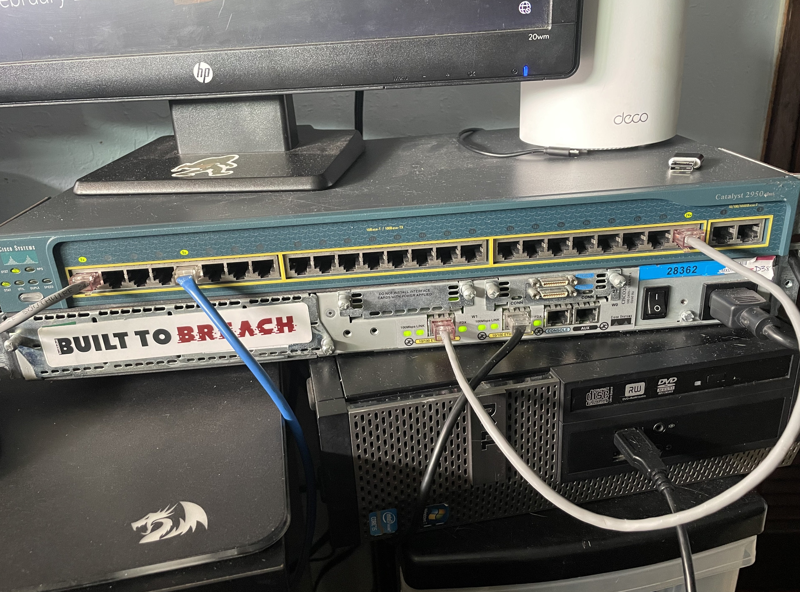
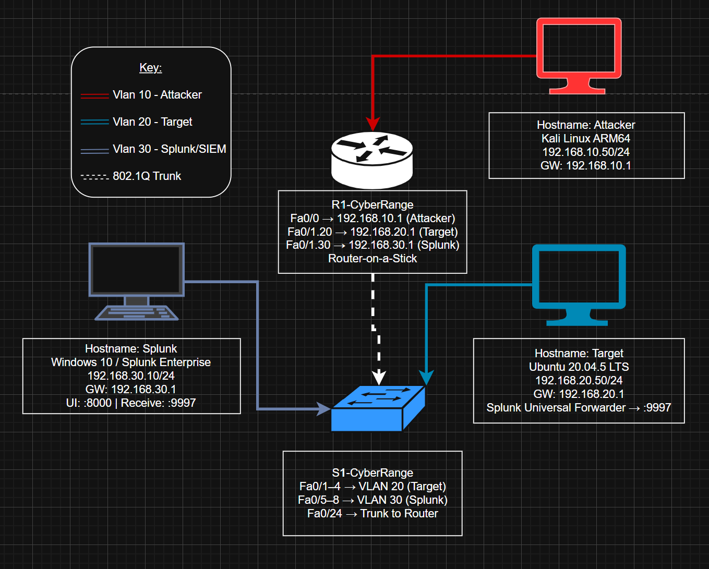

# Home Cyber Range
A mix of personal notes and technical writeup from building my own physical cyber range. 

*Features: multi-VLAN, built mostly with Raspberry Pis and legacy Cisco hardware I got from my networking processor. Designed for practicing offensive security, defensive monitoring, and network engineering in a segmented environment.*

You can also read the overview level writeup at [saucedasecurity.com](https://saucedasecurity.com)

---

## Hardware


| Component | Device |
|-----------|--------|
| Attacker | Raspberry Pi 5 — Kali Linux |
| Target | Raspberry Pi 3 Model A+ — Ubuntu 20.04.5 LTS |
| SIEM/Indexer | Dell Optiplex — Windows 10, Splunk Enterprise |
| Extra Target *(planned)* | Raspberry Pi 4 (8GB) — freed up from Splunk role*, will run Juice Shop or Metasploitable |
| Router | Cisco 2621 |
| Switch | Cisco Catalyst 2950 |

---
*I had originaly planned to use QEMU to run splunk enterprise on the RPi 4 but after hitting many issues, I pivoted to the Optiplex filling that role instead. 

## Network Design + Topology


### IP Scheme

| Role | VLAN | Subnet | Device IP | Gateway |
|------|------|--------|-----------|---------|
| Attacker | 10 | 192.168.10.0/24 | 192.168.10.50 | 192.168.10.1 |
| Target | 20 | 192.168.20.0/24 | 192.168.20.50 | 192.168.20.1 |
| Splunk/SIEM | 30 | 192.168.30.0/24 | 192.168.30.50 | 192.168.30.1 |

Splunk gets its own VLAN for enterprise realism — in a real SOC, the monitoring infrastructure is always isolated from the networks it watches.

### Physical Wiring

```
[RPi 5 — Kali Attacker]
        |
       Fa0/0
        |
[Cisco 2621 Router]
        |
       Fa0/1 (trunk)
        |
       Fa0/24 (trunk)
        |
[Cisco Catalyst 2950 Switch]
        |                    |
    Fa0/1-4              Fa0/5-8
    (VLAN 20)            (VLAN 30)
        |                    |
[RPi 3A+ — Target]    [Optiplex — Splunk]
```

### Router-on-a-Stick

The Cisco 2621 only has one interface facing the switch, so inter-VLAN routing is handled via subinterfaces on Fa0/1. Each subinterface gets `encapsulation dot1Q <vlan-id>`, which tags outgoing frames so the switch knows which VLAN they belong to. The switch port on the other end is configured as a trunk so it accepts tagged frames rather than dropping them.

---

## Router Setup

**Hardware:** Cisco 2621
**Console:** COM3, baud 9600 (via PuTTY)
**Config file:** [`router/config.ios`](router/config.ios)

### Password Recovery

On first boot, the enable password was unknown, so break into ROMMON mode:

1. In PuTTY: **right-click title bar → Send Command → Break** while the router is booting
2. At the `rommon>` prompt, tell the router to ignore its startup config:
   ```
   confreg 0x2142
   reset
   ```
3. At the setup dialogue, answer **no**
4. Enter enable mode (no password required now), then reset cleanly:
   ```
   enable
   erase startup-config
   reload
   ```
5. Reconfigure from scratch using [`router/config.ios`](router/config.ios)

### Key Config Notes

- `no ip domain-lookup` — stops the router trying to DNS-resolve mistyped commands, which causes a long hang
- `ip routing` — enables L3 routing between interfaces (off by default on some IOS versions)
- The parent interface `Fa0/1` has **no IP address** — IPs live on the subinterfaces only. Trunks are just links, not L3 interfaces.
- `encapsulation dot1Q` implements 802.1Q frame tagging, which is what makes router-on-a-stick work

> **Gotcha:** If the router config disappears after a reboot and the hostname has reverted, the config was never saved. Always run `write memory` before disconnecting. The config in [`router/config.ios`](router/config.ios) can be pasted in fresh in under a minute.

---

## Switch Setup

**Hardware:** Cisco Catalyst 2950
**Config file:** [`switch/config.ios`](switch/config.ios)

### Key Config Notes

- Management IP is on VLAN 1 (`192.168.20.2`), default gateway pointing at the router
- The trunk port `Fa0/24` uses `switchport trunk allowed vlan 10,20,30,1002-1005` — the `1002-1005` are legacy reserved VLANs that Cisco requires in the allowed list, otherwise the command is rejected with `Bad VLAN list`. These date back to when Cisco switches supported non-Ethernet L2 technologies (FDDI, Token Ring).
- Without a trunk port, tagged frames from the router subinterfaces get dropped — access ports only accept untagged frames for a single VLAN

### Verify After Applying Config

```
show vlan brief
show interfaces status
show running-config
```

---

## Attacker Setup (RPi 5 — Kali)

1. Flash Kali Linux ARM64 image to SD card using Raspberry Pi Imager
   - Hostname: `attacker`, username: `target`
2. Set static IP in `/etc/network/interfaces`:
   ```
   auto eth0
   iface eth0 inet static
     address 192.168.10.50
     netmask 255.255.255.0
     gateway 192.168.10.1
   ```
3. Apply: `sudo systemctl restart networking`

See [`attacker/`](attacker/) for future tooling and scripts.

---

## Target Setup (RPi 3 Model A+ — Ubuntu 20.04)

**Netplan config:** [`target/netplan.yaml`](target/netplan.yaml)
**Forwarder setup:** [`target/setup-forwarder.sh`](target/setup-forwarder.sh)

Ubuntu 20.04 manages networking via **Netplan** (YAML-based), not `/etc/network/interfaces`. The legacy `ifconfig` and `route` commands are also not installed by default — you can use `ip a` and `ip route` instead.

Copy [`target/netplan.yaml`](target/netplan.yaml) to `/etc/netplan/01-netcfg.yaml` and apply:
```bash
sudo netplan apply
```
Also, if you can't find where the netplan is located or what it's called, you can find it with  
```bash
ls -l /etc/netplan/
```

### Password Recovery (Ubuntu on RPi)

The typical `init=/bin/bash` kernel parameter causes a **kernel panic** here. The reason: `init=/bin/bash` is interpreted during the initramfs stage, before the real root filesystem is mounted — and initramfs doesn't have bash, so the kernel panics trying to find it.

The boot sequence on this image is: U-Boot → initramfs loads into RAM → kernel starts and mounts initramfs as temporary root → initramfs scripts find and mount the real root partition → systemd starts. The `init=` trick intercepts too early.

The fix is to let initramfs complete normally, then intercept at the systemd level:

1. Mount the SD card on another machine and open `cmdline.txt`
2. Append `systemd.unit=emergency.target` to the end of the existing line — **do not add a new line**, `cmdline.txt` must be exactly one line
3. The full line will look like:
   ```
   elevator=deadline net.ifnames=0 console=serial0,115200 dwc_otg.lpm_enable=0 console=tty1 root=LABEL=writable rootfstype=ext4 rootwait fixrtc systemd.unit=emergency.target
   ```
4. Boot the Pi — it drops into a root emergency shell
5. Remount root as read-write and change the password:
   ```bash
   mount -o remount,rw /
   passwd root
   sync
   ```
6. Shut down, remove `systemd.unit=emergency.target` from `cmdline.txt`, and boot normally

### Splunk Universal Forwarder

Run [`target/setup-forwarder.sh`](target/setup-forwarder.sh) while the Pi still has internet access (before plugging it into the isolated range). It installs the ARM64 forwarder, points it at the Optiplex, and sets it to ship `auth.log` and `syslog`.

---

## Splunk Setup (Optiplex — Windows 10)

**Firewall rules:** [`optiplex/firewall-rules.bat`](optiplex/firewall-rules.bat)

After exhausting the RPi + Docker + QEMU path (see [Why Not the RPi?](#why-not-the-rpi----full-qemusplunk-post-mortem) below), Splunk runs on a Dell Optiplex with Windows 10. This is also more architecturally realistic — production SIEMs run on dedicated x86 hardware.

### Installation

Download the `.msi` installer from splunk.com and run it. Starts with no issues on native x86.

### Static IP (set before plugging into the range)

**Network Settings → Ethernet → Edit:**

| Field | Value |
|-------|-------|
| IP | 192.168.30.50 |
| Subnet | 255.255.255.0 |
| Gateway | 192.168.30.1 |
| DNS | 8.8.8.8 |

### Firewall Rules

Run [`optiplex/firewall-rules.bat`](optiplex/firewall-rules.bat) in an elevated prompt:

```bat
netsh advfirewall firewall add rule name="Allow ICMP" protocol=icmpv4 dir=in action=allow
netsh advfirewall firewall add rule name="Splunk Forwarder" dir=in action=allow protocol=TCP localport=9997
```

### Enable Receiving in Splunk UI

**Settings → Forwarding and Receiving → Configure Receiving → New → Port 9997**

Verify it's listening:
```bat
netstat -an | findstr 9997
# Should show: TCP    0.0.0.0:9997    ...    LISTENING
```

### Verify Forwarder Connectivity from the Pi

```bash
nc -zv 192.168.30.50 9997
# Expected: Connection to 192.168.30.50 9997 port [tcp/*] succeeded!
```

---

## Why Not the RPi? — Full QEMU/Splunk Post-Mortem

Splunk has no ARM64 build. The only path to running it on a Pi is Docker + QEMU userspace emulation — the ARM64 kernel transparently hands AMD64 binaries to a QEMU interpreter at runtime. This worked for basic containers but Splunk's entrypoint pushed it past what QEMU can handle.

### What Actually Worked

- Registering the binfmt_misc handler (via Python raw bytes — see below)
- Running lightweight AMD64 containers: `docker run --platform linux/amd64 alpine uname -m` → `x86_64`
- Splunk's Ansible configuration playbook — 58 of 60 tasks completed over ~24 minutes

### The binfmt Registration Problem

Manual registration via `echo` or `printf` fails because shell escaping corrupts the binary magic bytes — the offset field ends up as letter `O` instead of zero, and the path gets a hyphen dropped. The only reliable method is Python writing raw bytes directly:

```bash
sudo python3 -c "
entry = b':qemu-x86_64:M:0:\x7fELF\x02\x01\x01\x00\x00\x00\x00\x00\x00\x00\x00\x00\x02\x00\x3e\x00:\xff\xff\xff\xff\xff\xfe\xfe\x00\xff\xff\xff\xff\xff\xff\xff\xff\xfe\xff\xff\xff:/usr/bin/qemu-x86_64-static:F\n'
open('/proc/sys/fs/binfmt_misc/register','wb').write(entry)"
```

This write doesn't survive a reboot — install [`splunk/binfmt-qemu-x86_64.service`](splunk/binfmt-qemu-x86_64.service) to persist it.

### Where It Broke: sudo Inside the Container

The official `splunk/splunk` image uses an Ansible-based entrypoint that calls `sudo` for privilege escalation. QEMU userspace emulation does not correctly emulate the setuid bit on executables, so every `sudo` call fails:

```
sudo: effective uid is not 0, is /usr/bin/sudo on a file system with the 'nosuid' option set?
```

Setting `ANSIBLE_BECOME=false` and `--user root` got Ansible past this — all 58 configuration tasks ran. But Ansible's hardcoded final task called `splunk start` without `--run-as-root`, so Splunk exited rc=1.

### The Final Wall: splunkweb Never Starts

After manually starting Splunk post-Ansible with `--run-as-root`, splunkd (the backend) came up fine. But `splunkweb` — the Python/Tornado/React web UI — never initialized. Port 8000 never appeared in `/proc/net/tcp6`, and `web_service.log` was never written (meaning the process crashed before it could log anything).

The root cause: splunkweb is a heavyweight Python application. Under full x86_64 instruction emulation on ARM64, every CPU instruction in the Python interpreter and Splunk's web stack is being translated in real time. The startup overhead is too great for the process to initialize successfully.

### Task Timings Under QEMU (for reference)

| Task | Duration |
|------|----------|
| Gathering Facts | ~43 seconds |
| Generate user-seed.conf | ~40 seconds |
| Check if requests_unixsocket exists | ~1 minute |
| Update Splunk directory owner (recursive chown) | 8+ minutes |
| Full Ansible playbook (58 tasks) | ~24 minutes |

### Conclusion

QEMU userspace emulation is fine for simple AMD64 containers. It is not viable for Splunk Enterprise — the combination of setuid emulation bugs and splunkweb's Python startup overhead is a hard ceiling. The RPi 4 originally intended for Splunk will instead become a second target node running Juice Shop or Metasploitable.

---

## Connectivity Verification

From the attacker Pi once everything is up:

```bash
ping 192.168.10.1   # local gateway (router Fa0/0)
ping 192.168.20.1   # router subinterface for VLAN 20
ping 192.168.20.50  # target Pi
ping 192.168.30.50  # Splunk Optiplex
```

---

## Troubleshooting

**Router config gone after reboot / hostname reverted**
Config was not saved. Always `write memory` before disconnecting. Repaste [`router/config.ios`](router/config.ios).

**`Bad VLAN list` error on switch trunk port**
Must include legacy VLANs 1002-1005: `switchport trunk allowed vlan 10,20,30,1002-1005`.

**VLAN 10 traffic not reaching targets through switch**
Trunk allowed list defaulted to VLAN 1 only. Explicitly set: `switchport trunk allowed vlan 10,20,30,1002-1005`.

**`encapsulation dot1Q` overlap error on router**
Parent interface `Fa0/1` still has an IP. Run `no ip address` on `Fa0/1` before configuring subinterfaces.

**`init=/bin/bash` causes kernel panic on Ubuntu RPi**
Use `systemd.unit=emergency.target` instead — see password recovery under Target Setup.

**QEMU binfmt handler not registered after reboot**
Install and enable [`splunk/binfmt-qemu-x86_64.service`](splunk/binfmt-qemu-x86_64.service).

**Splunk forwarder can't reach Optiplex on 9997**
Check: (1) firewall rules applied on Optiplex, (2) receiving port enabled in Splunk UI, (3) `netstat -an | findstr 9997` shows `LISTENING`. Test from the Pi: `nc -zv 192.168.30.50 9997`.

---

## Planned Upgrades (where I want to take this lab next)

- **Active Directory lab** — laptop running Windows 10 VM + AD server, or cloud-hosted, so I can practice AD hacking.
- **Second target** — RPi 4 running Juice Shop or Metasploitable on VLAN 20.
- **Wireless AP* - Add a Linksys E5350 Router running OpenWRT to enable a wireless attack vector.
- Adding a mail server (iRedMail or something similar) to enable studying phishing infastructure + email based attacks.
- Suricata as a network IDS, for fine tuned rules and avoids splunk alert fatigue.   
